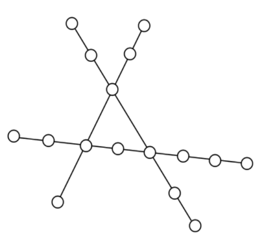

# Railways network

A test problem solving task to simulate movement of the trains along railways.

● You are given 3 railways with train stations

● There is a single train on each rail

● Each train can carry n passengers

● Upon reaching a terminus station, a train will change direction

● All trains take the same amount of time from one station to another

● When two trains meet at a junction, the one with fewer passengers will wait until the
other moved on

## Getting Started

To test the app, clone or download the repository and run index.html file in web browser of your choice.
